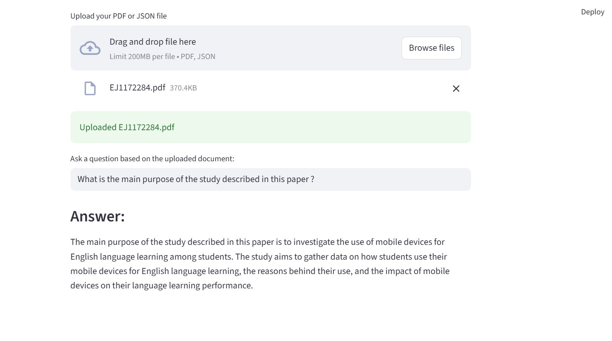

# 📄 Document Q&A App (Streamlit + LangChain + Groq)

An intelligent Q&A tool that allows users to upload PDF or JSON files and ask natural language questions about the document. Built using LangChain, HuggingFace embeddings, ChromaDB, and Groq’s blazing-fast LLMs.


## 🚀 Features

- 📁 Upload `.pdf` or `.json` files
- 🔍 Extracts and chunks document content
- 🧠 Embeds text using HuggingFace's MiniLM
- 🧠 Stores embeddings in ChromaDB (in-memory vector store)
- 🤖 Answers questions using Groq’s LLaMA 3.1-8b model
- 💬 Fully interactive Streamlit interface

---

## 🖼️ Screenshot



---

## 🔄 Flowchart

Visual overview of how this app works:


---

## 🧱 Tech Stack

| Component       | Tool/Library                        |
|----------------|--------------------------------------|
| UI             | Streamlit                            |
| LLM            | Groq (LLaMA 3.1-8b)                  |
| Vector Store   | ChromaDB                             |
| Embeddings     | HuggingFace `all-MiniLM-L6-v2`       |
| Document Loader| LangChain Loaders (PDF, JSON)        |
| Chunking       | LangChain Text Splitter              |

---

## 📦 Installation

### 1. Clone the Repository

```bash
git clone https://github.com/battu2n/DocAnalyzer-.git
cd DocAnalyzer-
2. Install Requirements
bash
Copy
Edit
pip install -r requirements.txt
3. Set up .env file
Create a .env file in the root of the project with the following:

env
Copy
Edit
GROQ_API_KEY=your_groq_api_key_here
Do not commit .env. It’s already in .gitignore.

▶️ Run the App
bash
Copy
Edit
streamlit run app.py
Open in browser at: http://localhost:8501

📁 Supported Formats
.pdf — processed using PyMuPDF or PyPDF

.json — assumes data inside .data field

📑 Example Use Case
Upload a research report or policy document and ask:
"What is the main conclusion of the paper?"

📄 License
This project is licensed under the MIT License.

🙌 Acknowledgements
LangChain

Groq

Streamlit

Chroma

HuggingFace.


